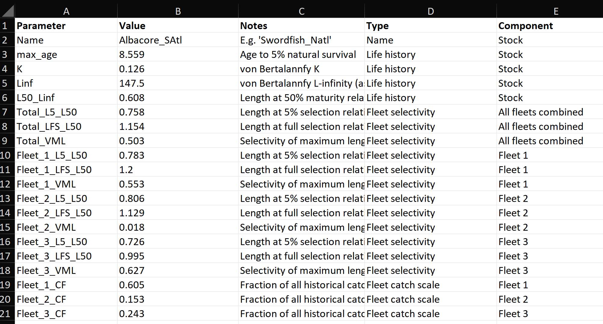
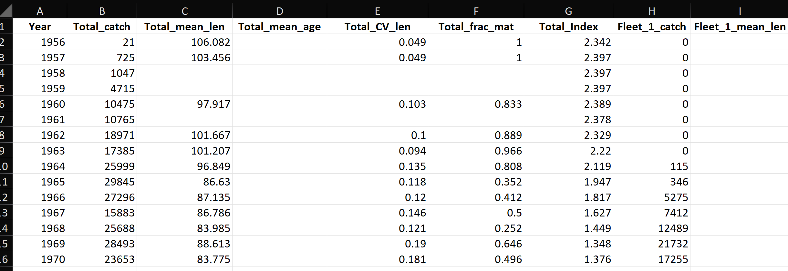
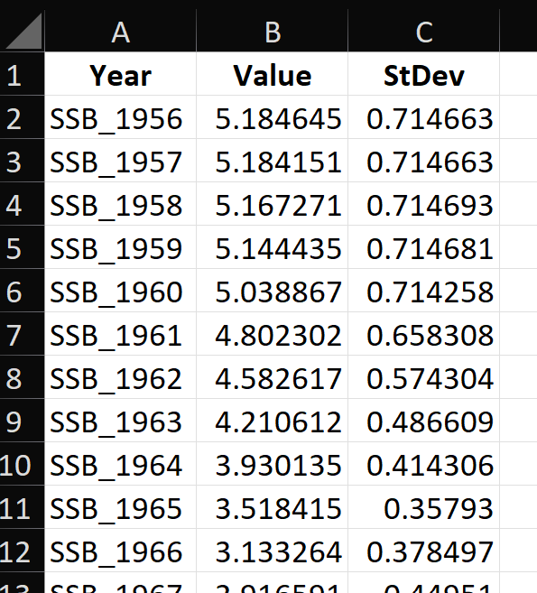
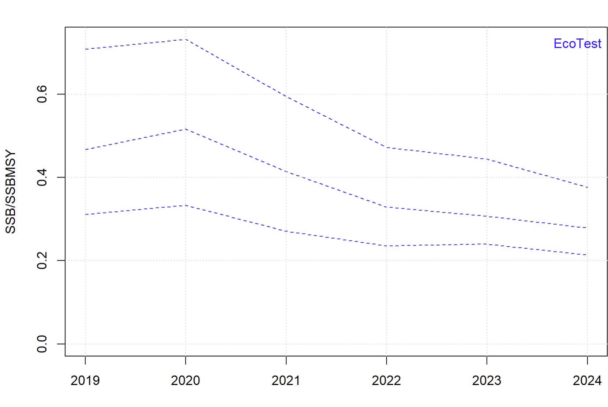
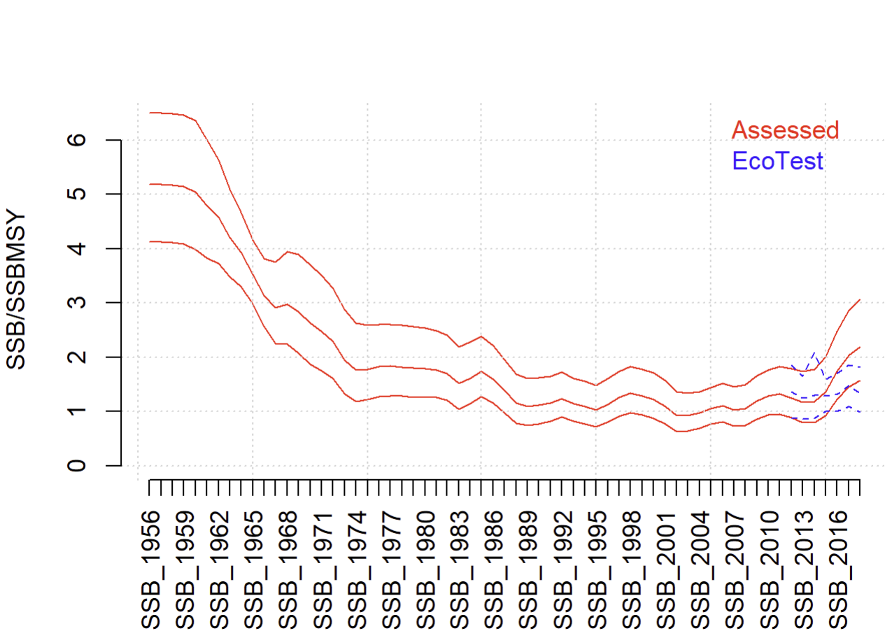

&nbsp;


<style>
  .col2 {
    columns: 2 200px;         /* number of columns and width in pixels*/
    -webkit-columns: 2 200px; /* chrome, safari */
    -moz-columns: 2 200px;    /* firefox */
  }
  .col3 {
    columns: 3 100px;
    -webkit-columns: 3 100px;
    -moz-columns: 3 100px;
  }
  .col4 {
    columns: 4 100px;
    -webkit-columns: 4 100px;
    -moz-columns: 4 100px;
  }
</style>

<style type="text/css">

body{ /* Normal  */
   font-size: 12px;
}
td {  /* Table  */
   font-size: 10px;
}
h1 { /* Header 1 */
 font-size: 18px;
 color: DarkBlue;
}
h2 { /* Header 2 */
 font-size: 15px;
 color: DarkBlue;
}
h3 { /* Header 3 */
 font-size: 14px;
 color: DarkBlue;
}
code.r{ /* Code block */
  font-size: 10px;
}
pre { /* Code block */
  font-size: 10px
}
</style>


***


***


***

```{r setup, include=FALSE}
library(EcoTest)
library(EcoTestData)
library(kableExtra)
library(readxl)

knitr::opts_chunk$set(echo = FALSE)

maketab <- function(dir,Alab="Statistical Area"){
  filenam = list.files(dir)
  nf = length(filenam)
  DF = data.frame(filenam)
  names(DF) = c("Area")
  #filepath = list.files(dir, full.names = T, include.dirs = T)
  fit.link = paste0('<a href=', file.path(dir, filenam), '> ', DF$Area , ' </a>')
  DF$Area <- fit.link
  DT::datatable(DF, escape=1,
                colnames=c(Alab),
                filter = 'top',
                options = list(
                  pageLength = 10, 
                  autoWidth = TRUE,
                  sDom  = '<"top">lrt<"bottom">ip'))
}


plotatab <- function(filey,sheet,head=T){
  if(head){
    dat = read_xlsx(paste0(getwd(),"/",filey),sheet)
    kable(dat,"simple") 
  }else{
    dat = read_xlsx(paste0(getwd(),"/",filey),sheet,col_names=F)
    kable(dat,"simple",col.names=rep("",ncol(dat))) 
  }
}


getprojectinfo<-function(page){
  tab=as.data.frame(read_excel("project_Info/Status Assumptions To do.xlsx", sheet = page))
  tab=tab[,2:3]
  tab[is.na(tab)]=""
  kable(tab,"simple")#,col.names=rep("",2)) 
}
  

getprog<-function(page){
  tab=as.data.frame(read_excel("Project_Info/Progress.xlsx", sheet = page))
  tab=tab[,2:3]
  tab[is.na(tab)]=""
  kable(tab,"simple")#,col.names=rep("",2)) 
}

TD = prepare_TD()  

```


## Disclaimer

The following work is preliminary and subject to ongoing investigation.   

These analyses do not necessarily reflect the point of view of ICCAT or the FAO and in no way anticipate ICCAT or FAO future policy.

***


## Objective

Develop a flexible and powerful indicator of stock status for tunas, billfish and sharks that can be tested theoretically and empirically. 

***


## Project Details

Title: 'Simulation Testing Ecosystem Indicators: Support to ICCAT's Ecosystem Approach to Fisheries Management (EAFM)'

```{r ProjDets, eval=T}
dat<-data.frame(c("Term","Funding body","Funding stream","Call No.","Project Partners","Blue Matter Team","ICCAT Collaborators"),
                
                 c("Dec 2023 - June 2026",
                   "International Commission for the Conservation of Atlantic Tunas (ICCAT)",
                   "FAO Global Environmental Facility (GEF) Common Oceans ABNJ Tuna Project Fund",
                   "# 11903 / 2023",
                   "Blue Matter Science Ltd.",
                   "Tom Carruthers, Adrian Hordyk, Quang Huynh",
                   "Nathan Taylor"))

kable(dat,"simple",col.names=rep("",2)) 

```

***


## Introduction

### Problem Statement

To meet the requirements of the precautionary approach and the ecosystem approach to fisheries management (EBFM), indicators of stock status are needed for secondary species, defined here as those lack sufficient data or capacity to conduct routine stock assessments (see Carruthers et al. 2024 for a detailed problem statement). Any such indicator be sound theoretically and should be validated empirically.  

A well-documented, defensible and transparent framework is needed to support tactical decision making to move beyond the single species assessment paradigm and make progress towards the essential goals of EBFM.


### Approach

The EcoTest project aims to use simulation modelling to identify data types and algorithms that can inform stock status of secondary species and then validate these indicators empirically in cases where there have been defensible stock assessments. 

In the EcoTest framework, a large training dataset (TD) serves as a central resource for testing indicators. Those could include proposed data types for use in an indicator or those available for a given case study. 

If, for example there are 15 data inputs for a given stock, the training dataset is subsetted to those inputs, and neural networks trained to see whether in theory those data could provide sufficient information about stock status. Hence EcoTest includes a built-in theoretical test of a proposed indicator. 

The flexibility of neural networks alleviates the need to specify and code bespoke fishery dynamics models for every possible combination of data inputs. For example, a neural network indicator can be trained (and used for prediction) on only catches and mean lengths or alternatively, recent CPUE indices and recent catches. The focus is on the information content of the data and the estimation performance of the indicator. 


### Indicator 1 - Bespoke Training Data and Neural Network Indicators
 
Previous EcoTest research consolidated the dynamics of six stock assessments for species caught in the North Atlantic longline fisheries (swordfish, bigeye tuna, albacore tuna, shortfin mako shark, white marlin and blue marlin) into a multi-species, multi-fleet operating model (Huynh et al. 2022). Those models were used to simulate various future scenarios for fishing and stock dynamics to develop Indicator 1: an indicator specific to the longline case study that could predict stock status for those 6 species without undergoing a full stock assessment (Carruthers et al 2024). The performance of Indicator 1 was generally very good, but it was applicable only to the 6 species of the operating model. 

A key advance in developing Indicator 1 was the use of deep learning to train neural network indicators. The large number of simulated fisheries provided both true, simulated stock status and also a wide range of possible input data types (features). This training dataset was essentially a large table, including more than 20 thousand fishery simulations. Each line representing a simulation. The first column contained the true, simulated stock status, the remaining 450+ columns were 'features' - potential data inputs that could be available in a real fishery setting for estimating stock status. 


### Indicator 2 - Generic Training data

The original ETest package was built around Indicator 2: an evolution of the original approach, that includes a testing dataset from a much more general set of simulations encompassing population and fishing dynamics for a wide range of pelagic highly migratory species (sharks, billfish and tunas) [Carruthers & Taylor 2025](https://www.iccat.int/Documents/CVSP/CV082_2025/n_6/CV082060109.pdf). 


### Indicator 3 - Time-Series Training Data, Time Series Interpolation and a Wider Range of Simulated Life Histories and Fisheries

The newer EcoTest package is a substantial update on ETest and makes use of a larger and more general training dataset that better characterizes historical time series data. Neural networks trained on Indicator 3 provide improved precision and can be applied to a much wider range of life-histories in the groups of billfish, sharks and tunas. 


### Indicator 4 - Time Series Neural Networks

In order to better characterize the interaction and time-dependencies of the time-series data (e.g., catches, indices, mean length), Indicator 4 includes an temporal input layer in which multivariate time series inputs are combined, and their temporal properties and interactions may be characterized. The principal motivation behind this alternative indicator structure is to develop indicator behaviors comparable to conventional assessment models. 


### Empirical Comparisons

The EcoTest package now includes a total of 9 stock assessments - based datasets of billfish, tuna and sharks that can be used to make empirical comparisons (how well do the EcoTest indicators estimate stock status relative to stock assessments with the same data inputs?). 

***

## The Idea Behind EcoTest

### A Theoretical Model of Stock and Fishery Dynamics 

EcoTest uses a conventional age-structured models to generate simulations of fisheries over a wide range of life-history and exploitation dynamics. Those age-structured equations are the theoretical basis of the stock assessments models used in the provision of managment advice for data-rich tuna, billfish and shark species. Ie in its current form EcoTest assumes the same underlying theory used in management advice. In principle, other theoretical such as Ecosim-with-Ecopath (Figure below) or Atlantis could be used for simulating fisheries. 


### The Training Dataset

Over a very large number of simulations a single year is selected and true, simulated stock status is taken from the model along with simulated data, and observable aspects of life history (e.g. growth and longevity) and fishing dynamics (e.g. selectivity). The outputs are processed into a large training dataset (many thousands of simulations) where each row is a simulation containing a number of columns. The first is the target variable of interest (stock status) and each subsequent column is a potential data input that could be used to estimate the target variable (e.g., indices over recent years, maximum age, somatic growth etc.). 

The data inputs relate to time series data such as catches, CPUE indices and mean length in catches are processed and formatted in such a way that they can be calculated for any fishery (e.g. mean length in catches is phrased as a percentage of asymptotic length, catch trends and index trends have mean 1). 


### Identifying Data Streams available for a Particular Case Study

For a given case-study only some of the data inputs (types of data, data streams) of the full training dataset may be available. The training dataset is subsetted to include only those data inputs. 


### Training an AI Indicator on a Subset of the Training Data that Matches Data Inputs of the Case Study

It has been demonstrated that Artificial Neural Networks (ANNs) are able to approximate any continuous function provided they are specified with sufficient number of parameters (width of a single-layer ANN). For this reason they provide a very flexible, model-free approach to estimating stock status from user-specifed data inputs. They can reveal the information content of various data types, determine expected indicator performance and then rapidly provide stock status estimates for a new dataset. 


### Empirical Testing of the AI Indicator

Once an indicator has been established (a set of case-study specific data inputs and a trained neural network) and determined to perform adequately in theory, it may be then validated empirically using established approaches for stock assessment (e.g. stock assessments). 


### Use the Indicator to Estimate Stock Status

Assuming the indicator passes both theoretical evaluate and empirical validation, data inputs for a real case-study can be formatted and submitted to the indicator to determine stock status. 


***

## Uses of EcoTest

### Theoretical Testing of Proposed Indicators

EcoTest can be used to theoretically test the performance of a proposed set of data inputs for an indicator. The user subsets the training dataset to include only those data inputs and then fits a neural network to evaluate performance using cross-validation. 

During training a validation dataset is used to check for model overparameterization and confirm predictive ability for independent data not used by the training algorithm.After training, the expected indicator performance is evaluated according to a completely independent testing dataset. 

### A Custom Indicator for a Case Study. 

EcoTest can accept a range of data inputs (features) that may be available for secondary species derived from data streams such as total annual catches, CPUE indices, mean length in catches and mean age in catches (Table 1). These can be provide along with life-history (e.g. somatic growth, natural survival) and fleet-specific (e.g. selectivity) characteristics to potentially improve reliability in interpreting these data inputs.  Where multiple fleets can be identified, data inputs can be provided for up to 3 individual fleets. Where multiple stocks can be assumed to have been exploited by a common fishery with comparable exploitation history, multi-stock data inputs can be used including catch ratios of one stock relative to another. 

### Triage for Secondary Species

Potentially the least demanding use of the EcoTest approach would be to rapidly obtain preliminary estimates of status for the various secondary species in order to conduct a triage, identifying those for which estimated status is considered below target levels. This could be used to instigate more in-depth investigation of data for those stocks. 
 

***


## Installation

### R and RStudio

The Keras, Tensorflow and Miniconda libraries on which EcoTest methods depend require the latest versions of R and RStudio. 

It is <u>highly</u> recommended that users install the very latest version of R and RStudio before continuing (you will almost certainly have difficulties otherwise). 


R can be downloaded from the [R Project for Statistical Computing webpage](https://cloud.r-project.org/).

Currently the EcoTest package is compatible with R version `r R.Version()$version.string`. 

RStudio can be downloaded from the [Posit webpage](https://www.rstudio.com/).

Currently the EcoTest package is working in RStudio version 2026.08.0 Build 187. 

The EcoTest package has only been tested on a Windows x64 system.  


### Installing R Packages

Open RStudio and run the following lines of code at the R command prompt: 

```{r Installation, eval=F,echo=T}

# Keras, Tensorflow, Miniconda

# --- Step 1 ---
install.packages("keras3")
library(keras3)

# --- Step 2 ---
Install Git from https://git-scm.com/install/windows and restart RStudio

# --- Step 3 ---retr
reticulate::install_python(version = '3.11', force=TRUE) 

# --- Step 4 ---
install_keras() 

# EcoTest packages 

# --- Step 5 ---
install.packages("pak")
pak::pkg_install("blue-matter/EcoTestData")
pak::pkg_install('blue-matter/EcoTest')

```


### Test Installation

To test your installation run the following code

```{r Test_Install, eval=F,echo=T}
library(EcoTest)
TD = prepare_TD()        
EcoTest::train_NN(TD)

```

If your packages are working you should see something like this:


***


## Worked Examples

### Quick Demonstration With User-Specified Features

Lets just assume we have some data on catches, recent CPUE and a bit of life history info. Remember, these names have to match the EcoTest codes for indicator features (see Table 1 below). 

```{r Quick_start_train, eval=F,echo=T}
library(EcoTest)
library(EcoTestData)
TD = prepare_TD()      # Prepare training data for indicators 3 and 4
names(TD)[1:100]       # Take a look at the names of the first 100 features of the training dataset

data0 = data.frame(
  K = 0.25,            # von B. somatic growth 
  M_K = 1.05,          # Instantaneous natural Mort. / von B. K 
  maxa = 11,           # Age at 5% survival 
  L50_Linf = 0.74,     # Length at 50% maturity (spawning fraction) / asymptotic length (L-infinity) 
  L5_L50_T = 0.2,      # Shortest length at 5% selectivity relative to length at 50% maturity 
  LFS_L50_T = 1.2,     # Length at full selectivity relative to length at 50% maturity
  C_1_T = 0.05,        # Initial catch relative to long-term average
  C_21_T = 1.55,       # Mid-history (there are 40 interpolations) catch relative to long-term average
  C_40_T = 0.42,       # Current catch relative to long-term average
  I_1_T = 3.29,        # Initial relative abundance index relative to long-term average
  I_21_T = 1.33,       # Mid-history index relative to long-term average
  I_40_T = 0.51,       # Recent index relative to long-term average
  ML_40_T = 0.72,      # Current mean-length in catches relative to long-term average
  MV_40_T = 0.22,      # Current variability in lengths in catch 
  FM_40_T = 0.62,      # Current Fraction of mature fish in catch
  MA_40_T = 0.37       # Current mean age of caught fish relative to maxage (maxa)
)

mydata = list(log(data0))       # Correct format is a list (multiple list positions can be used for retrospectives)
class(mydata) = "ETData"
check_train_data(mydata, TD)    # Check that names match TD and that features of data are in the range of the TD

my_indicator = train_ind_3(mydata, TD, nepoch = 10)  # Train a neural network (indicator 3) on the inputs available 


```


You can see that the performance of this indicator isn't stellar however it correctly classifies stocks below half SSBMSY (an ICCAT limit reference point) and above SSBMSY (an ICCAT target reference point) in about 75% and 90 % of simulations, respectively. 

For now we are going to assume we find this acceptable (you might well not!). 

We can now obtain a point estimate of stock status using our indicator and the dataset provided: 

```{r Quick_start_est, eval=F,echo=T}
pred_ind(my_indicator)                  # Estimated SSB relative to SSBMSY
```

Since only one set of data were provided there is only a point estimate of stock status. However most datasets can be sampled to provide stochastic inputs (bootstrapping etc). 

For the purposes of demonstration lets just create some samples of data so you can plot indicator estimates that include uncertainty:

```{r Quick_start_stoch, eval=F,echo=T}
data = mydata[[1]]
nsamp = 50                                                  # 50 stochastic draws of the dataset
nobs = ncol(data)                                           # data set has nobs features (data types)
log_norm_err = rlnorm(nobs*nsamp,0,0.1)                     # demo error 
data_repped = rep(as.numeric(data),each=nsamp)              # duplicate data for nsamp rows
data_s = array(data_repped * log_norm_err,c(nsamp,nobs))    # combine data with errors
data_s = as.data.frame(data_s)                              # make into data frame
names(data_s) = names(data)                                 # make sure to copy over labels

mydata_s = list(data_s)                                     # make an input object where position one in the list is the data
class(mydata_s) = "ETData"
my_indicator_s = train_ind_3(mydata_s, TD, nepoch = 10)     # train the indicator
my_pred_s = pred_ind(my_indicator_s)                        # make a status prediction for each of the 50 samples of data
hist(my_pred_s$pred, xlab="Est SSB/SSBMSY", main="Demo Stochastic Indicator", col="cornflowerblue", border="white")

```


&nbsp;


### The Training Dataset and Theoretical Indicator Performance 

The training dataset 'TD' can be built from a set of data objects in the EcoTestData R package. To build the training dataset you use the prepare_TD() function. R session when you load the EcoTest library. The training dataset is very large including more than 130 thousand simulated fisheries and more than 1000 features (types of data input, e.g. somatic growth rate K is a 'feature'). 


```{r train_NN, eval=T,echo=T}
TD = prepare_TD()
dim(TD)
TD[1:3, 1:20]
```

This training dataset shows the range of conditions that were simulated. These provide an idea of whether the indicator is applicable to a new dataset. 

Here for example, is the range of von Bertallanfy growth and natural mortality in the training dataset:

```{r train_NN2, eval=F,echo=T}
plot(exp(TD$K),exp(TD$K + TD$M_K), xlab = "von B. K", ylab="Nat. Mort.",pch=19, cex=0.5, col="#0000ff50",xlim=c(0.15,0.8))
```


If you wish to know the theoretical performance of indicator 3 based on a particular set of input data you can use the train_NN(). Lets try this for the full dataset:

```{r train_NN3, eval=F,echo=T}
NN1 = train_NN(TD, nodes = c(15, 10), nepoch = 30) # 15 notes in first hidden layer, 10 in the second. 30 iterations
```


The RStudio viewer window shows the progression of the neural network training over 30 epochs (estimation iterations, passes through the backprogation algorithm). 

As the training progresses, mean absolute error (MAE) and the value of the loss function (loss) for the training dataset (blue) decreases (predicted log(SSB/SSMSY) gets closer to the simulated log(SSB/SSBMSY)). As the line plateaus, this indicates that the neural network is not finding a better fit to the data. 

The green line represents the MAE and loss of the validation dataset, an independent set of data not used in the training. These lines should track one another. If not it is possible that the model is over parameterized (blue line below green line) or that the validation dataset is not representative of the training dataset (see validation_split). 

The RStudio plot window shows the simulated vs predicted chart:


Using all the features (all of the data inputs, columns) of the training dataset we can achieve very good stock status estimation performance using the default neural network. If the stock was below half of SSBMSY then the indicator would correctly identify this in around 86% of simulations. If the stock was above SSBMSY, the indicator would correctly identify this in 93% of simulations. 

Of course we might not have access to all of those data types. Lets subset the training dataset to see how well an indicator of status would work with the life history, catch and mean length data:

```{r train_NN_sub, eval=F,echo=T}

ft = names(TD)               # the names of all features
lhft = c("Brel","K","M_K","maxa","L50_Linf","L5_L50_T","LFS_L50_T","VML_T") # Brel is first column - the response Var.
is_LH = ft %in% lhft         # those features relating to life-history and selectivity
is_T = grepl("_T", ft)       # features that are for all fishing activities in total
is_ML = grepl("ML_",ft)      # those features relating to mean length
is_C = grepl("C_",ft)        # those features relating to Catch indices

keep = is_LH | (is_T &  (is_ML | is_C)) # Life history or ML or C from the total fleet
subTD = TD[,keep]

subNN = train_NN(subTD)

```


The mean absolute error of the indicator is substantially higher and the classification errors are much higher, but theoretical performance based on just catches and mean length may be considered acceptable for a secondary species. 

It's possible that a more complex neural network might provide better performance. The default is 10 nodes in the first layer and 5 in the second layer. 

This might seem like a simple neural network and compared the many billion parameter large language models (LLMs) of openAI and Anthropic, it is. However by conventional fishery modelling standards, this simple model includes a large number of parameters (model weights). The dataset subTD has 88 features in the input layer. That means 10 * 88 weights before the first layer of nodes. There are 10 * 5 between the first and second layers and another 5 before the output layer (the response variable, log(SSB/SSBMSY)). 

That means a total of 935 parameters. 

But, lets lose our mind for a second and make a much more complicated network and fit it for longer. This one has 13,850 parameters (!):

```{r train_NN_sub_complex, eval=F,echo=T}

subNN2 = train_NN(subTD, nodes = c(100,50), nepoch = 30)

```


The neural network is continuing to find a better fit to the training dataset (blue) but without seeing any benefits in fit to the validation dataset (green). This suggests that the performance it is obtaining on the training set is not representative of what can be expected for an independent dataset. The model is over parameterized. The solution in such cases is to either simplify the model, make the dataset larger (more simulations in training and validation dataset) or increase the fraction of simulations in the validation set (parameter validation_split in functions train_NN and train_ind). 


### Get an Estimate of Stock Status from Single Species Data

In this example we will process some example data, train an indicator and estimate stock status using it. 

Perhaps the simplest way to import data to EcoTest is to use the standard Excel input workbook. The workbook contains three worksheets. The first includes parameters relating to life-history and selectivity:



Selectivity can be defined by all fleets combined (Total, '_T') or alternative/additionally by three individual fleets (Fleet_1, 'f1'; Fleet_2, 'f2'; Fleet_3, 'f3'). 

The second sheet is for time series data and includes catches (catch, 'C'), mean length (mean_len, 'ML'), mean age (mean_age, 'MA'), annual coefficient of variation in lengths (CV_len, 'MV'), fraction mature (frac_mat, 'FM') and an index of biomass (Total_Index, 'I') for all fleets combined or vulnerable biomass if by fleet (Fleet_1_Index).



There is also the option to include an estimated time series of SSB/SSBMSY (Brel) for comparative purposes: 



You can import this workbook using the function proc_i4: 

```{r load_blackfin, eval=F,echo=T}
blackfin_data = proc_i4("C:/GitHub/EcoTest_Train/Indicator_4/Secondary_species/BLF.xlsx",
                        nsim = 50,       # take 50 draws from the input file
                        retros = 5,      # do 5 retrospective peels 
                        extrapolate = T, # extrapolate first (backwards) and last (forwards) observation to missing data
                        minspan = 10)    # only accept time series data that span at least 10 years
```

The first thing to check is that the EcoTest data object (class ETData) has features that are within the range of those in the training dataset. 

```{r check_blackfin, eval=F,echo=T}
check_train_data(blackfin_data, TD)
```

In this case we can see that the L5_L50_T (all fleets combined minimum length at 5% selectivity) is higher than the highest value in the training dataset. 

Let's go ahead and train indicator 3 for this data set: 

```{r train_blackfin, eval=F,echo=T}
blackfin_ind = train_ind_3(blackfin_data, TD, c(50, 10), nepoch = 30)
```

When an indicator is trained a number of important steps are taken and captured in the output. 

(1) The overall training dataset (TD) is subsetted to the features of the available data
(2) The subsetted dataset is split into training, validation and testing datasets. Training is used to fit the neural network, validation is used to evaluate overparameterization during fitting. Testing is completely independent and used to evalute expected performance of an indicator. 
(3) The training set, validation set, testing set, and data are normalized according to the mean and variation of the training set. 
(4) The neural network is initialized given the design specified by the argument 'nodes'
(5) The neural network is fitted
(6) Fitting diagnostics are reported
(7) All datasets, models and diagnostics are returned in an indicator object

Note that any dataset has to be normalized in the same way as the training dataset. So you need to run the network training to make an indicator object (e.g. 'blackfin_ind') that parcels all these datasets together appropriately. 

```{r model_blackfin, eval=F, echo=T}
blackfin_ind$model                         # Take a look at the model specified
```
We can now calculate the predicted status and plot it: 

```{r pred_blackfin, eval=F, echo=T}
blackfin_pred = pred_ind(blackfin_ind)     # Predict stock status
plot_ind(blackfin_pred)                    # Simple plot
```



In this case stock status is estimated to be low and declining over the last 6 years. 


### Example datasets

The EcoTestData R package comes with a number of example datasets (class ETData). 

These datasets can include a list item 'Brel' (relative biomass, SSB/SSBMSY) which originate from another assessment method. The idea is to provide a reference for EcoTest estimates from another approach. Nine of the available datasets are actually input data from Stock Synthesis 3 stock assessments. 

You can find these data files like this: 

```{r, eval=T, echo =T}
alldats = findy('ETData')
isassessed = sapply(alldats,function(x){y=get(x);("Brel" %in% names(y))})
alldats[isassessed]
```

The other datasets come from secondary species that do not have stock assessments (no Brel slot): 

```{r, eval=T, echo =T}
alldats[!isassessed]
```

Lets take a look at the South Atlantic Albacore Tuna dataset: 

```{r, eval=T, echo=T}
names(Albacore_SAtl) # A list 8 items long. Current data (position 1, 'peel_0') and 6 retrospective peels ('peel_1' - 'peel_6') and the reference Brel slot. 
```

We will train an indicator (indicator 3), estimate stock status and compare it with the assessment estimates over the most recent years. 

```{r, eval=F, echo=T}
SALB_ind = train_ind_3(Albacore_SAtl, TD, c(50, 25), nepoch = 30)
SALB_pred = pred_ind(SALB_ind)
retro_ind(SALB_pred)
```




***


## Summary of EcoTest Indicator Features (data types)

To use EcoTest, you must format your input data as described in Table 1. 

Table 1. Indicator Features (data types)

```{r Features, eval=T,echo=F}
plotatab('tables/Various.xlsx','Features')

```

You can always list the full set of names of all the possible features by getting the names of the training dataset:

```{r Features_TD, eval=T,echo=T}
names(TD)

```


***


## Software and Code

[Rapid Conditioning Model (RCM) (Huynh 2024)](https://samtool.openmse.com/reference/RCM.html)

[OpenMSE (Hordyk et al. 2024)](https://openMSE.com)


***


## Neural Network Links

[Zhou's intro to ANN and machine learning](https://victorzhou.com/blog/intro-to-neural-networks/)

[Keras 3: Deep learning API](https://keras.io/)

[Tensorflow: Platform for machine learning](https://www.tensorflow.org/)

[Nvidia CUDA Toolkit: GPU accelerated applications](https://developer.nvidia.com/cuda-toolkit)

***


## Recent Presentations

[EcoTest Phase 3 SCRS/2024/87](\presentations\SCRS-2024-87 Carruthers et al EcoTest Phase III.pptx)

[EcoTest Indicator 2 SCRS/2025/109](\presentations\SCRS-2025-109 Carruthers Taylor EcoTest Indicator 2.pptx)


***


## References

Carruthers, T.R. 2018. A multispecies catch-ratio estimator of relative stock depletion. Fisheries Research. 197: 25-33, https://doi.org/10.1016/j.fishres.2017.09.017.

[Carruthers, T.R., & Taylor, N.G. 2025. EcoTest Indicator 2: A general purpose stock status indicator for sharks, billfish and tunas.](https://www.iccat.int/Documents/CVSP/CV082_2025/n_6/CV082060109.pdf) 

[Carruthers, T.R., Huynh, Q., Taylor, N.G. 2024. EcoTest Phase III: Simulation testing Ecosystem Indicators. SCRS/2023/087. ](https://www.researchgate.net/publication/385130368_ECOTEST_PHASE_III_SIMULATION_TESTING_ECOSYSTEM_INDICATORS)

Huynh, Q., 2025. Rapid Conditioning model. Available from [https://openmse.com/tutorial-rcm/](https://openmse.com/tutorial-rcm/) 

[Huynh, Q., Carruthers, T., Taylor, N.G. 2022. EcoTest: a proof of concept for evaluating ecological indicators in multispecies fisheries, with the Atlantic longline fishery case study. SCRS/2022/106.](https://iccat.int/Documents/CVSP/CV081_2024/n_4/CV08104087.pdf) 

Juan-Jordá, M.J., Murua, H., Arrizabalaga, H., Dulvy, N.K., and Restrepo, V. 2018. Report card on ecosystem-based fisheries management in tuna regional fisheries management organizations. Fish Fish. 19: 321-339.

***


## Acknowledgements

EcoTest is funded by ICCAT as part of a commitment to the Global Environmental Facility (GEF) Common Oceans ABNJ Tuna Project Fund.

Many thanks to The Ocean Foundation and the Pew Charitable Trusts for funding Phases I and II of the EcoTest framework. 

Many thanks to the ICCAT Ecosystem working group for comments on earlier versions of EcoTest: Nathan Taylor, Alex Hanke, Sachiko Tsuji, Guillermo Diaz, Diego Alvarez, Laurie Kell, Maria Juan Jorda, Andres Domingo.  

Blue Matter: Tom Carruthers, Adrian Hordyk, Quang Huynh

OpenMSE was developed with support from the Natural Resources Defense Council (NRDC), the Gordon and Betty Moore Foundation, the Packard Foundation, the Marine Stewardship Council, Fisheries and Oceans Canada (DFO), the U.S. National Oceanic and Atmospheric Administration, the International Commission for the Conservation of Atlantic Tunas (ICCAT) and The Ocean Foundation.

OpenMSE continues to be developed with the support of the The Ocean Foundation. 


*** 


&nbsp;&nbsp;&nbsp;&nbsp;&nbsp;&nbsp;&nbsp;&nbsp;&nbsp;&nbsp;&nbsp;&nbsp;

